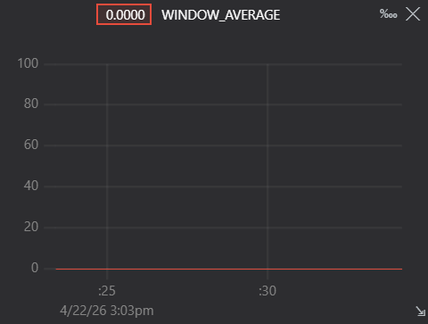
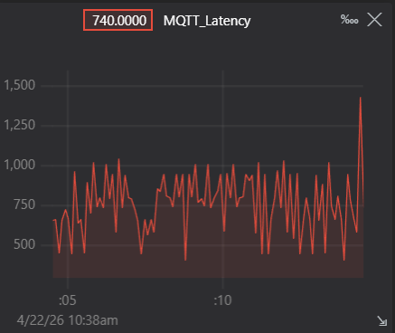
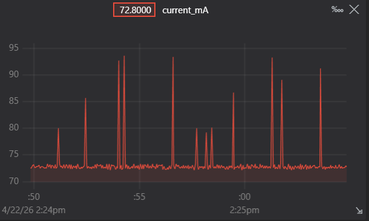
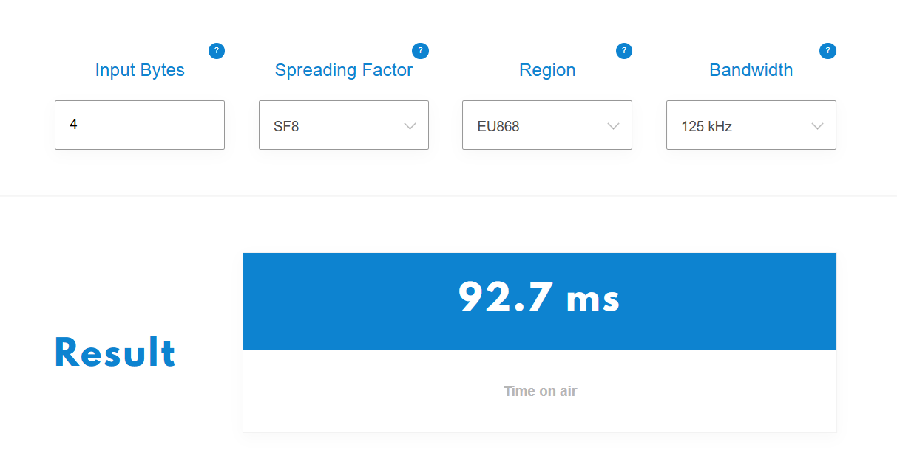

# IoT-Individual-Assignment
Individual Assignment for Internet of Things - Algorithms and Services course 2026
Author: Riccardo Passacantando

## The assignment
The requirements needed to solve the assignment are:

- Identify the maximum sampling frequency of the device
- Compute correctly the max freq of the input signal
- Compute correctly the optimal freq of the input signal
- Compute correctly the aggregate function over a window
- Evaluate correctly the saving in energy
- Evaluate correctly the communication cost
- Evaluate correctly the end-to-end latency
- Transmit the result to the edge server via MQTT+WIFI 
- Transmit the result to the cloud server via LoRaWAN + TTN

### Input Signal


After failing multiple times at generating a signal through audio cable or with DAC and losing a lot of precious time, I resorted to simulating the input signal with the firmware of my Heltec board.
In exchange I will do more precise tests on it.
The generated input signal is composed of two sine waves with different frequencies of the form SUM(a_k*sin(f_k)) and it's the following:
```
//2*sin(2*pi*3*t)+4*sin(2*pi*5*t)
const SignalComponent signal1[] = {
  {2.0, 3.0},
  {4.0, 5.0}
}; 
```

### Maximum Sampling Frequency
The Maximum Sampling Frequency depends on the hardware and thus on the method to obtain the signal. 
For example: if I had sampled the signal through the ADC instead of a simulated signal, the max frequency would have been different.
In my case i generated the signal internally so i wanted to test the hardware limits on the sampling doing the following:

1) Precalculate the signal lookup table for faster generation
2) Initialize list of frequencies (chosen manually to avoid a very long test)
3) Select starting sample frequency
4) Sample at that frequency for 5 seconds tracking errors
5) If you got no issues select next frequency and go back to point 3
6) Print out last valid frequency

To see the test in action turn the variable ENABLE_STRESS_TEST to true.
The result you get in the end should be like the one you see below, that is the actual result I got from the test.
You can change the values in testIntervals[] to try different values.

The values found were:
```
=== STRESS TEST COMPLETE ===
>max_frequency:6535.40
>max_interval_us:150
=== End of stress test ===
```

### Identify optimal sampling frequency
The ArduinoFFT library breaks the signal into frequency bins, each bin represents a frequency range, and its magnitude shows how strong that frequency is in the signal.
I chose 512 samples for frequency resolution. The FFT divides sampling rate by the number of samples to calculate bin spacing: Sampling Rate ÷ Number of Samples.

The precalculated lookup table contains 10,000 signal samples representing one full second. Each sample is 100 microseconds apart, effectively creating a 10 kHz "virtual sampling" of the signal.

As FFT_SIZE I chose 512 because its the right amount to detect 1Hz resolution signals.

So to calculate the optimal sampling frequency:

1) Pull 512 samples of the precalculated signal
2) Applu a Hamming windowing to reduce artifacts
3) Use FFT to convert time samples to frequency samples
4) Find and extract the peak frequency component
5) Use Nyquist theorem to find optimal sampling frequency Fs = 2 × f_max
6) Set SAMPLE_RATE and SAMPLE_INTERVAL_US
7) Print optimal sampling frequency obtained

Results obtained with signal1:
```
=== FFT ANALYSIS ===
>FFT Sampling Rate: 512.00 Hz
>FFT Peak Frequency: 5.00 Hz
>Optimal Sampling Frequency: 10.00 Hz
>Sampling Interval: 100000 µs
=== End FFT ===
```

### Compute aggregate function over a window
To compute the aggregate function over a window we simulate sampling our generated signal at the optimal sampling Frequency that we just found using the FFT, or we use the predefined one if the FFT function is disables. Given that we are in discrete time to simulate the number of times that we will be sampling the signal in a time windows of 5 seconds.

I had some issues doing this because the signal would get misaligned to the period and the average was oscillating around the 0 never being actually 0. I solved this forcing the windows to be aligned on the phase wrap.



### Communicate the aggregate value to the nearby server with MQTT
1. **Set up Moquitto**
  - Install  and set up the parameters, then setup the parameters of the wifi the `communication.cpp` script
2. **Install Node.js**
  - Use then `node tools/MQTTserver/edge_server.js` to send the ACK signal through MQTT

### Communicate the aggregate value to the cloud using LoRaWAN + TTN

For LoRaWAN I used the library RadioLib that is an actual de-facto standard for the LoRaWAN communication.
The main task sends the aggregated values on the queue and the lora task detects them and sends everything on TTN.

...ot this is what it had to do, but unfortunately it doesn't work because I'm not able to join the TTN.

#### Key Steps

1. **Register on TTN**  
   - Go to [TTN Console](https://console.thethingsnetwork.org/), select your region, and **create an account**.  
   - Create an **Application**, then **Register end device** to obtain your LoRaWAN credentials:  
     - `DevEUI`  
     - `AppEUI`  
     - `AppKey`  
  If you need help follow this link:
  https://docs.heltec.org/en/node/esp32/esp32_general_docs/lorawan/connect_to_gateway.html
2. **Add LoRaWAN Credentials**  
   - Store `DevEUI`, `AppEUI`, and `AppKey` in `communication.cpp` like in: [secrets-example.h](IoT_Individual/src/communication.cpp)
3. **Join the Network and Transmit**  
   - On boot, the device sends a join request to TTN.  
   - Once joined, it transmits the **rolling average** value periodically, encoded as a **4-byte float**.  
   - Transmission occurs within a FreeRTOS task to ensure proper timing and multitasking.
4. **View messages on the TTN interface**

## Performance of the system

### Measure per-window execution time


### Measure volume of data transmitted


### Measure Latency
To measure latency of communication simply watch the latency printed when sending messages with mqtt.
When a message is published to iot/average, the current time is recorded.
When an ACK is received on iot/ack, the latency is calculated as the difference between current time and send time, then printed out on serial.

To send the ACK use `node tools/MQTTserver/edge_server.js` and see the plotted values on Teleplot.



From here we can see the latency goes from 0.4ms to 0.8ms, but this depends on the type of connection is being used.

### Energy Consumption
The circuit for measuring the energy uses this schema:

'''
USB Power (5V)
    ↓
INA219 Sensor
    ├─→ SDA → GPIO8 of ESP32-C3
    ├─→ SCL → GPIO9 of ESP32-C3
    └─→ +5V output → Heltec 5V
        ↓
    GND → common to all devices INA219 IN+ (measurement point)

ESP32-C3 (Controller):
    - Reads INA219 via I2C
    - Outputs CSV data @ 115200 baud
    - Plots to serial monitor
'''

Depending on the tasks the board has to do, it has different consumptions. I will analyze here the behaviour where the device:
- generates the signal
- samples the signal
- sends it over on MQTT or LoRa

The FreeRTOS tasks are always active, resulting in a steady power draw from the CPU and memory. However, the wireless or LoRa transceiver is only enabled during transmission.



Here we have a plot of the current usage during normal operation without any data sending.


#### Consumption of LoRa
Every 10 seconds, the device transmits a small payload over LoRa containing the computed rolling average (a 4-byte float). This triggers a short spike in power usage, reaching at most xxx mA during transmission.
The duration of each LoRa transmission (time-on-air) is calculated based on the LoRaWAN physical layer settings, i set the datarate to 4 obtaining the following parameters:

**Datarate 3 in EU868 region:**
* Spreading Factor: SF8
* Bandwidth: 125 kHz
* Bit rate: ~3,125 bits/s

We can then estimate the time using the .



#### Consumption with WiFi
The device remains in WiFi connection state continuously but sends data only every 5 seconds.
So we have 2 behavious:
* Wifi Idle: with average consumption ~60 mA
* Wifi Transmission: with consumption ~180 mA every 0.1 second 


## Bonus section
In all the files with name starting with *filter* there are the functions to work with task of signals and noise related to the Bonus section.

### Different signals and sampling
By changing on the function call precalculateSignal the argument with signal1 signal2 or signal3 you can use different signals, remember to update the number of components of the signal if you use signal3.
Plus if you want to add a noise component just change False, to True on the arguments of that function.

There are 3 signals predefined:
```
const SignalComponent signal1[] = {
  {2.0, 3.0},
  {4.0, 5.0}
};

const SignalComponent signal2[] = {
  {1.0, 1.0},
  {3.0, 10.0}
};

const SignalComponent signal3[] = {
  {5.0, 2.0},
  {2.0, 7.0},
  {1.0, 15.0}
};
```

Narrow-band signals (signal1: 3–5 Hz) are adaptive sampling's sweet spot. FFT identifies the peak at 5 Hz and with Nyquist you samplie at 10 Hz. Over-sampling at, let's say, 100 Hz wastes 10× the resources. 

Spread-spectrum signals (signal2: 1–10 Hz) introduce risk. The highest frequency component (10 Hz) demands ≥20 Hz sampling. Adaptive works fine if FFT reliably detects it, but there's a problem: under-sample by just 5 Hz and aliasing corrupts everything. Over-sampling prevents this disaster.

Wideband signals (signal3: 2–15 Hz) are instead very difficult for adaptive sampling. At 30 Hz minimum sampling, we no longer save much versus conservative over-sampling. Worse, if lower-frequency components mask the 15 Hz peak in FFT, we could under-sample and miss it. 

Summing up: Adaptive sampling saves power and bandwidth when signal content is known and stable. On the other hand over-sampling trades efficiency for robustness, it costs more resources but can handle unknown or time-varying signals without recalibration. For the case of my setup with static signals (since they are precomputed), adaptive wins.
With real sensor data that changes over time, hybrid approaches work best: adaptive base rate + periodic FFT refresh + safety margin.

### Signal noise
Setting ENABLE_NOISE_AND_FILTERING to True, the signal will include a noise component n(t) and anomaly spikes A(t)


## About LLMs
LLMs are good tools to research and find informations on tools and methods to solve the problems.
But in the current state they still need guidance to solve the tasks.
During the first phase I asked my LLM of choice, that was Gemini 3 Pro, to clarify the task and it was of good use, but when it came to solving the actual task it failed to provide functioning code. Messing with non-existing libraries, trying out unefficient methods and writing a lot of unuseful code were just some of the problems I faced.
For the code I switched to Claude Haiku 4.5 and it proved more efficient with both code and questions on the code, but the issues were basically the same as Gemini's.
I used them to first clarify what was the task and the various methods to solve them, then I investigated what was the most efficient and made the LLM implement it. I checked everything the LLM wrote, fixing all the mistakes, manually replacing code where it was using strange looking function, and checking after every prompt if the code was working well and doing what it was supposed to do.
One notable example was the LoRa communication, that the LLM were very confused about. Couln't pick no implement one suitable library and was doing a lot of mistakes, so I had to stop it and manually research and implement one library, using the LLM only in the final phase to review errors and write small adjustments.
In the end, the LLMs provide invaluable utility when it comes to writing the logic of functions, but only if guided with knowledge on the structure to use for thoose methods, what to actually do and what to not do.

## Setup Guide
The final setup for this project consist only of the files on this repo.
The solution is split across different .cpp files to simplify reading the various functions.

The hardware things needed to run the project that are:

* Heltec ESP32 WiFi Lora v3 development board
* INA219 sensor to measure power consumption
* another esp32 board to monitor the consumption (I used and ESP32-C3 Supermini)

So to run correctly the project:

* Clone the repository
* Open with PlatformIO and wait for the dependancy to download
* Update the configuration for the wifi on the ```communication.cpp``` file
* Connect the board to your pc and upload the project.
* If you want to see the different parts of the project in action just change the **ENABLE_** variables on the top of ```main.cpp``` before uploading the program on the board.
* For almost every part, using the VS Code extension Teleplot you can see the graph of the values being plotted
* run the python scripts on /tools folder to test MQTT, LoRa, power consumption
