# IoT-Individual-Assignment
Individual Assignment for Internet of Things - Algorithms and Services course 2026  
Author: Riccardo Passacantando  

## The assignment
The requirements needed to solve the assignment are:

- Identify the maximum sampling frequency of the device
- Compute correctly the max freq of the input signal
- Compute correctly the optimal freq of the input signal
- Compute correctly the aggregate function over a window
- Evaluate correctly the saving in energy
- Evaluate correctly the communication cost
- Evaluate correctly the end-to-end latency
- Transmit the result to the edge server via MQTT+WIFI 
- Transmit the result to the cloud server via LoRaWAN + TTN

### Input Signal
<div style="display: flex;">
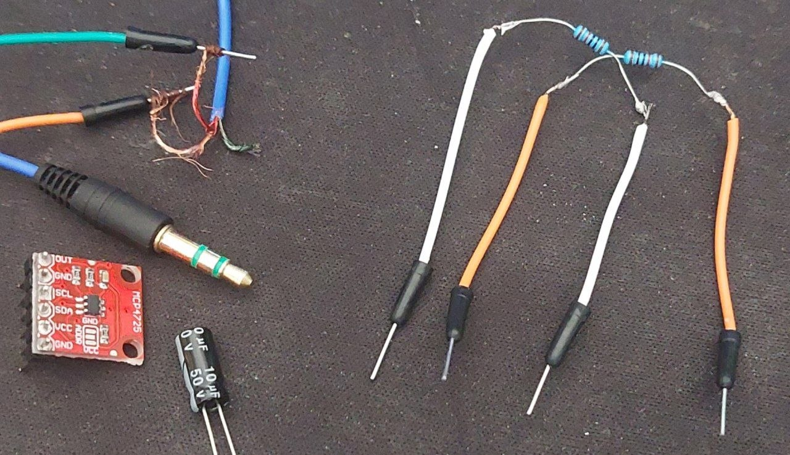
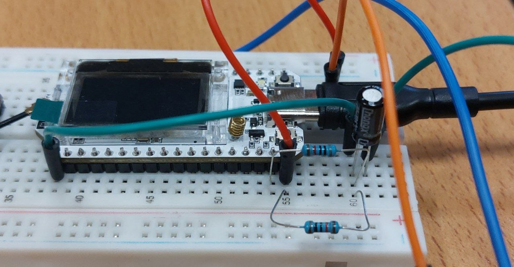
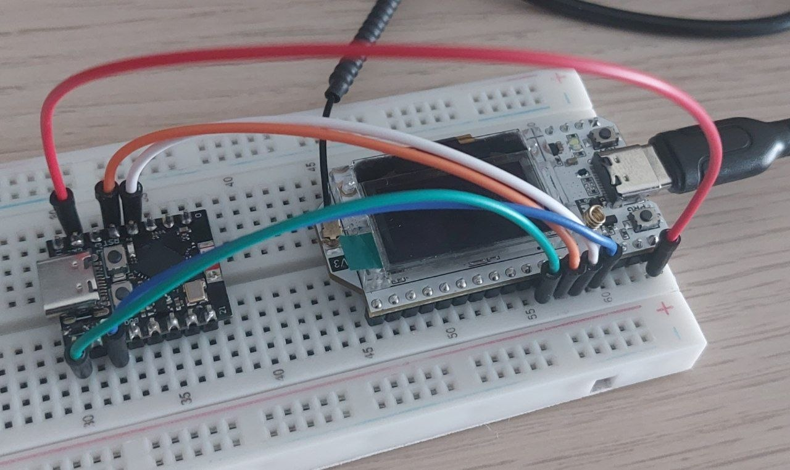
</div>

After failing multiple times at generating a signal through audio cable or with DAC and losing a lot of precious time, I resorted to simulating the input signal with the firmware of my Heltec board.  
I didn't manage to generate a clean signal that I could analyze and instead I was getting, in some cases only noise, in others a very noisy signal.

I tried 5 approaches(not in this order):
- UART trough pc usb cable  
  Capped at 921,600 bps and I discovered it myself because I lost a lot of time debugging the connection before discovering the 2Mbps of the USB connection is only theorical and the device could not handle that frequency.
- Audio jack cable from pc  
  Up to to ~20 kHz for signal, but it was so noisy that i started questioning my sampling before noticing the problem was my cable and i didn't have another one.
- Serial tx/rx through ESP32-C3  
  Up to 2Mbps to be stable, but I wanted to reach higher speeds, so I left this approach for SPI.
- SPI protocol through ESP32-C3  
  Up to 20MHz for data, but i could not setup it due to the lack of a proper slave SPI library for the Esp32.
- DAC with I2C on ESP32-C3 to Heltec ADC  
  Up to 15 kHz. Tried it for hours with different methods, connections, and boards, just to discover... that the board was fried.

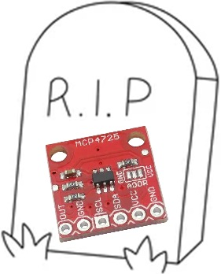  

The final simulated generated input signal is composed of two sine waves with different frequencies of the form SUM(a_k*sin(f_k)) and the example one is composed as 2*sin(2*pi*3*t)+4*sin(2*pi*5*t)

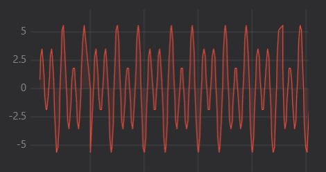

### Maximum Sampling Frequency
The Maximum Sampling Frequency depends on the hardware and thus on the method to obtain the signal. 
For example: if I had sampled the signal through the ADC instead of a simulated signal, the max frequency would have been different.  
In my case i generated the signal internally so I tested the hardware limits on the sampling doing the following:  

1) Precalculate the signal lookup table for faster generation
2) Initialize list of frequencies (chosen manually to avoid a very long test)
3) Select starting sample frequency
4) Sample at that frequency for 5 seconds tracking errors
For each interval, compares actual vs expected samples over 5 seconds. If unstable (>2% deviation) skips to next shorter interval immediately, if stable moves to the next interval only after 2 consecutive stable periods with no improvement.
5) If got no issues select next frequency and go back to point 3
6) Record last valid frequency

To see the test in action turn the variable ENABLE_STRESS_TEST to true.
The result you get in the end should be like the one you see below, that is the actual result I got from the test.
You can change the values in testIntervals[] to try different values.

The values found were:
```
=== STRESS TEST COMPLETE ===
>max_frequency:6535.40
>max_interval_us:150
=== End of stress test ===
```

This is the frequency that we can achieve with our hardware without any calculation in between.

### Identify optimal sampling frequency
The ArduinoFFT library breaks the signal into frequency bins, each bin represents a frequency range, and its magnitude shows how strong that frequency is in the signal.  
I chose 512 samples for frequency resolution. The FFT divides sampling rate by the number of samples to calculate bin spacing: Sampling Rate ÷ Number of Samples.

The precalculated lookup table contains 10,000 signal samples representing one full second. Each sample is 100 microseconds apart, effectively creating a 10 kHz "virtual sampling" of the signal.

As FFT_SIZE I chose 512 because its the right amount to detect 1Hz resolution signals.

So to calculate the optimal sampling frequency:

1) Pull 512 samples of the precalculated signal
2) Use FFT to convert time samples to frequency samples
3) Find and extract the peak frequency component
4) Use Fs = 5 × f_max to obtain the optimal sampling frequency
5) Set new SAMPLE_RATE (frequency)
6) Print optimal sampling frequency obtained

Why about the Nyquist? The theorem finds the MINIMUM required frequence and allows us to reconstruct the original signal, but it fails in capturing the details of the signal, potentially cutting out anomalies and noise.  
Sampling at 5x the maximum peak we can better capture every variation of the signal in near bands.

Results obtained with signal1:
```
=== FFT ANALYSIS ===
FFT Peak Frequency: 5.00 Hz
Optimal Sampling Frequency: 25.00 Hz
=== End FFT ===
```

### Compute aggregate function over a window
To compute the aggregate function over a window we simulate sampling our generated signal at the optimal sampling Frequency that we just found using the FFT, or we use the predefined one if the FFT function is disables. Given that we are in discrete time to simulate the number of times that we will be sampling the signal in a time windows of 5 seconds.  

I had some issues doing this because the signal would get misaligned to the period and the average was oscillating around the 0 never being actually 0. I solved this forcing the windows to be aligned on the phase wrap.  


So now since the phase is aligned and I filtered out the errors in the average calculation, I can generate a widow_average that is always close to 0 (except for calculation errors).

### Communicate the aggregate value to the nearby server with MQTT

For MQTT Wifi communication I used the Wifi and PubSubClient libraries.
I simply establish the connection and then send on the topic iot/average the average value.  
There is another topic iot/ack to which the device is subscribed that is used to calculated the communication time as described below.  

To see it in action:
1. **Set up Moquitto**
  - Install and set up the mosquitto.config, then setup the parameters of the wifi on the `communication.cpp` script
2. **Visualize plotted data with Teleplot**

### Communicate the aggregate value to the cloud using LoRaWAN + TTN

For LoRaWAN I used the library RadioLib that is an actual de-facto standard for the LoRaWAN communication.
The main task sends the aggregated values on a loraQueue, then the lora task detect the values on the queue, joins the TTN and sends everything on TTN every 10 seconds.

#### Key Steps

1. **Register on TTN**  
   - Go to [TTN Console](https://console.thethingsnetwork.org/), select your region, and **create an account**.  
   - Create an **Application**, then **Register end device** to obtain your LoRaWAN credentials:  
     - `DevEUI`  
     - `AppEUI`  
     - `AppKey`  
  If you need help follow this link:
  https://docs.heltec.org/en/node/esp32/esp32_general_docs/lorawan/connect_to_gateway.html
2. **Add LoRaWAN Credentials**  
   - Store `DevEUI`, `AppEUI`, and `AppKey` in `communication.cpp` like in: [secrets-example.h](IoT_Individual/src/communication.cpp)
3. **Join the Network and Transmit**  
   - On boot, the device sends a join request to TTN.  
   - Once joined, it transmits the **average** value periodically, encoded as a **4-byte float**.  
   - Transmission occurs within a FreeRTOS task to ensure proper timing and multitasking.
4. **View messages on the TTN interface**

## Performance of the system

### Measure volume of data transmitted
MQTT
Payload: 13 (payload) + 11 (topic) + 5 (MQTT header) + 54 (network overhead) ≈ 83 bytes/message  
Transmission rate: Every 100ms  
Volume: ~830 bytes/second  

LoRa
Payload: 1 byte (message) + 13 (LoRa Header)  
Transmission rate: Every 10 seconds  
Volume: ~1.4 bytes/second ≈ 5 KB/hour  

### Measure Per-Window execution time
With a simple time recording before the window calculation and after the calculation we can see how much time it takes to the cpu to process the windowing. I found out that, in the way i coded the windowing, it takes around 20ms (or ~19950 us) limiting us in the sampling rate, we will see it later in the oversampling section.  

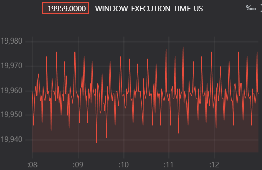

### Measure Latency
When a message is published to iot/average the current time is recorded.  
The module is then subscribed on the same topic, so when he sends the message awaits for it to come back and records the time.  
The latency is then calculated as the difference between current time and send time, then printed out on serial.

To measure latency of communication simply watch the latency printed when sending messages with mqtt, or watch the plotted values on Teleplot.  


From here we can see the latency ranges from 0.4ms to 1ms with occasional spikes to 1.5ms (on the plot the values are in microseconds), but this depends on the type of connection is being used.  
In this case I was with my phome wifi router very close to the pc with mosquitto on localhost and the heltec very near, so this values are justified.

### Energy Consumption
The circuit for measuring the energy uses an INA219 and an ESP32-C3 Supermini as measuring device.
The current flows into the ESP32-C3 through the pc usb connection, then goes from 3.3V to the INA, and 5V to power the Heltec.  Ground is shared between all devices.

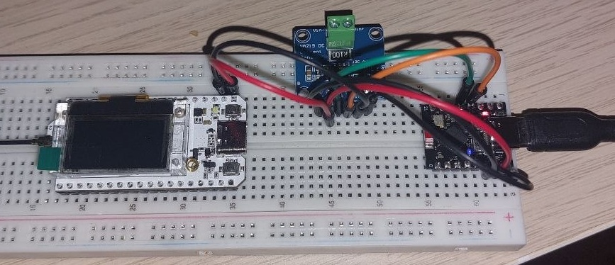

Depending on the tasks the board has to do, it has different consumptions. I will analyze here the behaviour where the device:
- generates the signal
- samples the signal
- sends it over on MQTT or LoRa

The FreeRTOS tasks are always active, resulting in a steady power draw from the CPU and memory. However, the wireless or LoRa transceiver is only enabled during transmission.


Initially I had this plot of the current usage during normal operation without any data sending.  

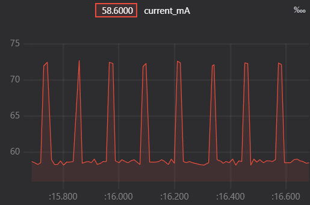

Increasing the sampling frequency of the ESP32-C3 reading the INA, i found out the signal generator was generating too fast and would fill the signalQueue too fast, and 100ms, like we see on the graphs, il the amount of time the QueueSend instruction awaits for the queue to have space available. This caused that spike, that I have then solved by checking the queue status before enqueueing values.

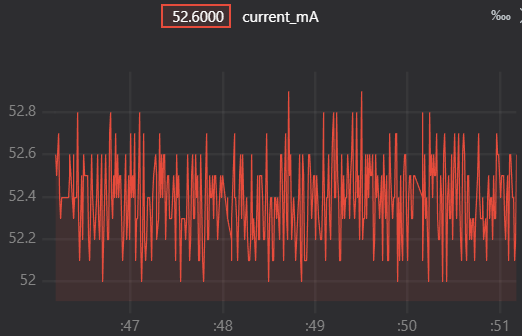

Checking now the consumption graph of the signal generation we have a very consistent plot of ~52.4mA.

#### Consumption of LoRa
Every 10 seconds, the device transmits a small payload over LoRa containing the computed rolling average. This triggers a short spike in power usage, reaching at most 120 mA during transmission.  
The duration of each LoRa transmission (time-on-air) is calculated based on the LoRaWAN physical layer settings, i set the datarate to 4 obtaining the following parameters:

**Datarate 4 in EU868 region:**
* Spreading Factor: SF8
* Bandwidth: 125 kHz
* Bit rate: ~3,125 bits/s

We can then estimate the time using the [TTN LoRaWAN airtime calculator](https://www.thethingsnetwork.org/airtime-calculator/).


So about the Duty Cycle of the LoRa modulewe can say that the radio is active for less than 1% of the time (92.7 ms / 10 s ≈ 0.93%) and the time occupied is well below the EU868 limits.

Given the behaviour described above we can estimate the power consumption during the LoRa transmission.

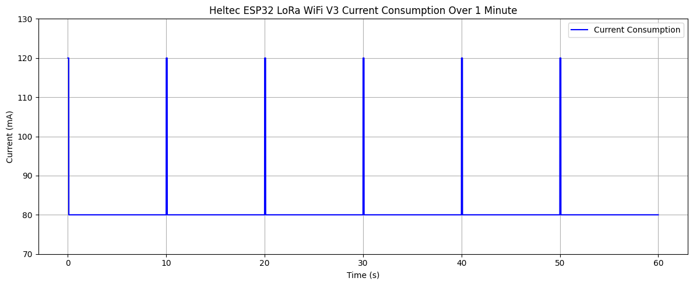
 But such consumption is only for a little fraction of each 10s period, so the overall consumption is negligible.

#### Consumption with WiFi
The device remains in WiFi connection state continuously but sends data only every 5 seconds.  
So we have 2 behavious:
* Wifi Idle: with average consumption ~135 mA
* Wifi Transmission: with consumption peak of ~155/160 mA every 0.1 second

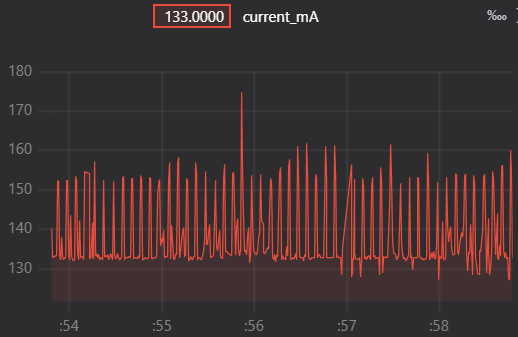

Here we can see how the current spikes as expected when a packet is transmitted every 0.1s.

#### Oversampling Consumption
For oversampling we use a frequency of 1kHz that is way more than what we need.  
I had an initial issue: as we saw on the stress test the board can handle until 65kHz, but that value is without any calculation on the signal, not even a print on serial, that can slow the process down.  
So the board was crashing when sampling at 1kHz, I solved temporarily commenting out all the calculations.  

We see here our signal that has an average consumption of ~74mA.  


#### Adaptive Sampling Consumption
We can see here that when using an optimal frequency of 50Hz the average consumption decreases to ~72mA with little spikes due to the queue management of the system.  
The original signal generation on its Task is still occurring at 10kHz, so the change of consumption from the oversampling is not significant, but still very visible here.  


## Bonus section

### Different signals and sampling
By changing on the function call precalculateSignal the argument with signal1 signal2 or signal3 you can use different signals, remember to update the number of components of the signal if you use signal3.  
There are small visualization artifacts due to the plotter, but the signal is correct since the window average was 0 at the time of recording.  

There are 3 signals predefined:

#### Signal 1
1) Amplitude 2, frequency 3Hz
2) Amplitude 4, frequency 5Hz


#### Signal 2
1) Amplitude 1, frequency 1Hz
2) Amplitude 3, frequency 10Hz

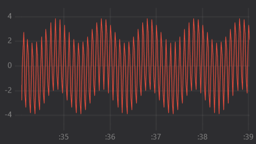

#### Signal 3
1) Amplitude 5, frequency 1Hz
2) Amplitude 2, frequency 7Hz
3) Amplitude 1, frequency 15Hz

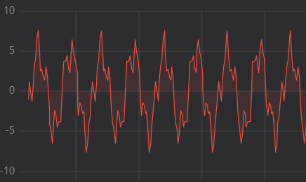

## About LLMs
LLMs are good tools to research and find informations on tools and methods to solve the problems.  
But in the current state they still need guidance to solve the tasks.  
During the first phase I asked my LLM of choice, that was Gemini 3 Pro, to clarify the task and it was of good use, but when it came to solving the actual task it failed to provide functioning code. Messing with non-existing libraries, trying out unefficient methods and writing a lot of unuseful code were just some of the problems I faced.  
For the code I switched to Claude Haiku 4.5 and it proved more efficient with both code and questions on the code, but the issues were basically the same as Gemini's.  
I used them to first clarify what was the task and the various methods to solve them, then I investigated what was the most efficient and made the LLM implement it. I checked everything the LLM wrote, fixing all the mistakes, manually replacing code where it was using strange looking function, and checking after every prompt if the code was working well and doing what it was supposed to do.  
One notable example was the LoRa communication, that the LLM were very confused about. Couln't pick no implement one suitable library and was doing a lot of mistakes, so I had to stop it and manually research and implement one library, using the LLM only in the final phase to review errors and write small adjustments.  
In the end, the LLMs provide invaluable utility when it comes to writing the logic of functions, but only if guided with knowledge on the structure to use for thoose methods, what to actually do and what to not do.  

## Setup Guide
The final setup for this project consist only of the files on this repo.  
The solution is split across different .cpp files to simplify reading the various functions.

The hardware things needed to run the project that are:

* Heltec ESP32 WiFi Lora v3 development board
* INA219 sensor to measure power consumption
* another esp32 board to monitor the consumption (I used and ESP32-C3 Supermini)

So to run correctly the project:

* Clone the repository
* Open with PlatformIO and wait for the dependancy to download
* Update the configuration for the wifi on the ```communication.cpp``` file
* Connect the board to your pc and upload the project.
* If you want to see the different parts of the project in action just change the **ENABLE_** variables on the top of ```main.cpp``` before uploading the program on the board.
* For almost every part, using the VS Code extension Teleplot you can see the graph of the values being plotted
* run the python scripts on /tools folder to test MQTT.
